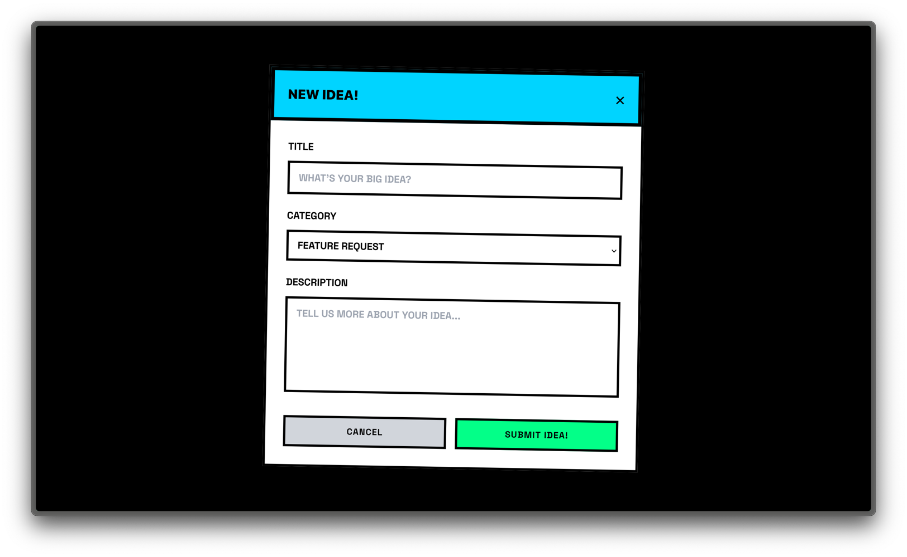
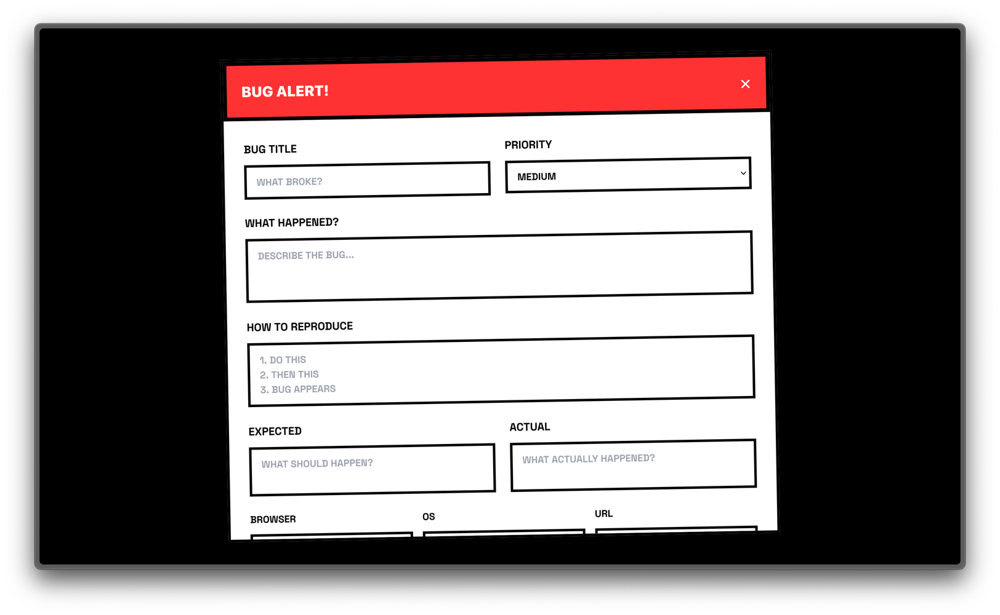
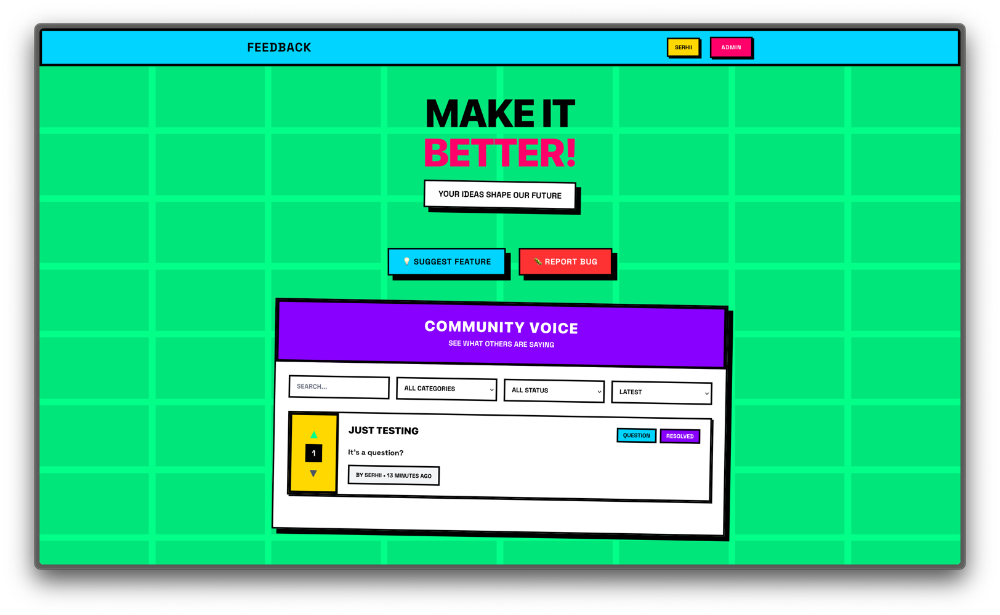
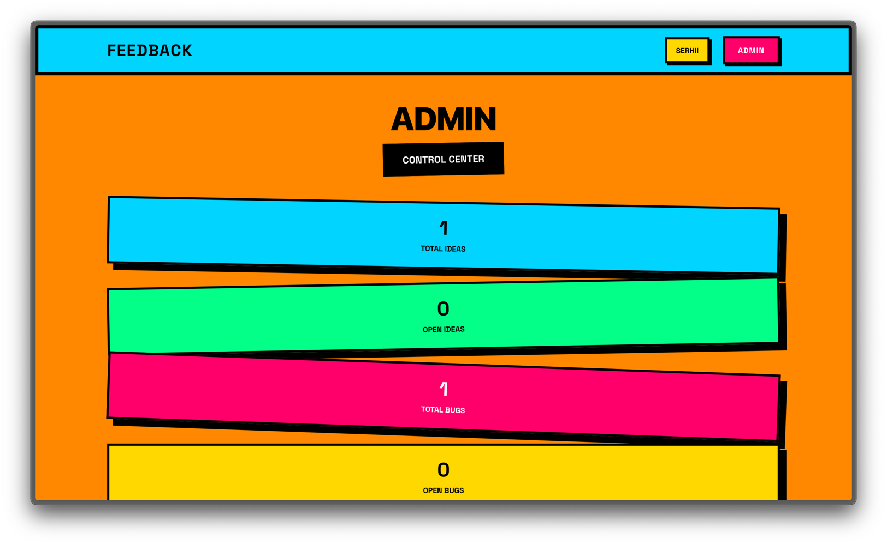
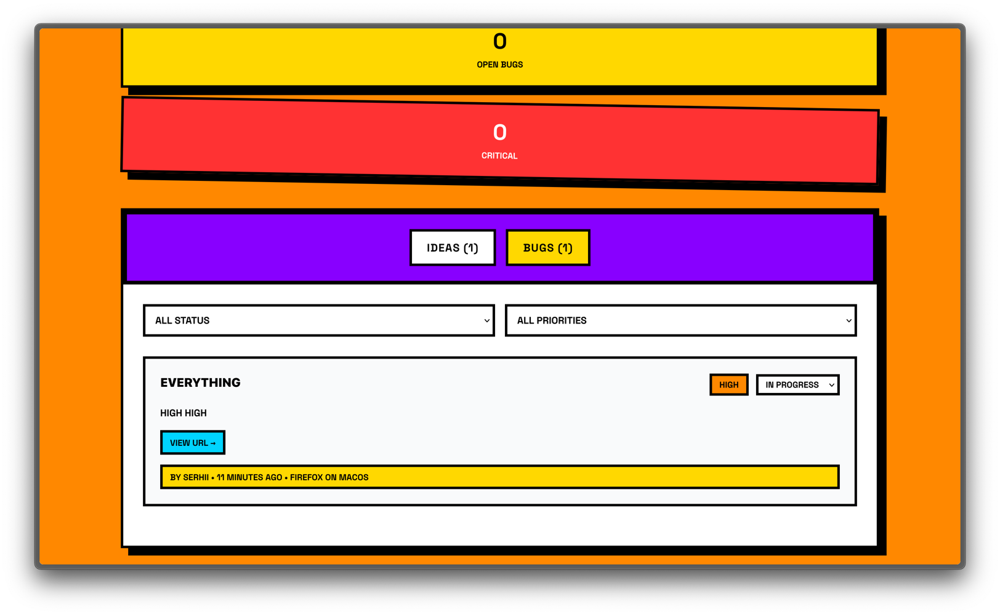

# Laravel Kuchi


[]()
[](https://packagist.org/packages/serhiikorniienko/laravel-kuchi)
[](https://packagist.org/packages/serhiikorniienko/laravel-kuchi)
[]()

```
In Japanese, "kuchi" (口), pronounced "koo-chee" directly translates to "mouth".
```

A comprehensive Laravel package for collecting user feedback and bug reports with a beautiful, interactive UI built with Livewire.

## Features

- 📝 **Feedback Collection** - Allow users to submit feature requests, improvements, and general feedback
- 🐛 **Bug Reporting** - Comprehensive bug reporting with steps to reproduce, browser info, and priority levels
- 👍 **Voting System** - Users can upvote/downvote feedback to prioritize features
- 🎛️ **Admin Dashboard** - Manage all feedback and bug reports with status updates
- 🎨 **Beautiful UI** - Modern, responsive interface built with Tailwind CSS and Livewire
- 🔐 **Authentication** - Only authenticated users can submit feedback (configurable)
- 📊 **Analytics** - Track feedback trends and bug report statistics
- ⚙️ **Configurable** - Extensive configuration options for customization

## Installation

Install the package via Composer:

```bash
composer require serhiikorniienko/laravel-kuchi
```

Run the migrations or publish (optional) them to your application:

```bash
php artisan migrate

php artisan vendor:publish --tag="kuchi-migrations"
```

Publish the configuration file (optional):

```bash
php artisan vendor:publish --tag="kuchi-config"
```

Publish the views for customization (optional):

```bash
php artisan vendor:publish --tag="kuchi-views"
```

## Configuration

The configuration file `config/kuchi.php` allows you to customize:

- Middleware for routes
- Admin users who can access the dashboard
- Categories for feedback
- Bug report priorities
- Status options
- Pagination settings

## Usage

### Basic Usage

To use the feedback and bug report forms, just provide the link for your users to access the feedback page. 
Add a button or any interactive element of your choice.

By default, the feedback page is available at `/feedback` (configurable via route prefix).

If you are using Livewire you can add the feedback components to any Blade template:

```blade
<!-- Feedback and Bug Report Forms -->
<livewire:feedback-form />
<livewire:bug-report-form />

<!-- Display Feedback List -->
<livewire:feedback-list />
```

### Admin Dashboard

Access the admin dashboard at `/feedback/admin` (configurable via route prefix).

Admin users are defined in the configuration file:

```php
'admin_users' => [
    'admin@example.com',
    1, // user ID
],
```

### Routes

The package registers the following routes:

- `GET /feedback` - Main feedback page
- `GET /feedback/admin` - Admin dashboard

### Models

The package provides three main models:

- `SerhiiKorniienko\LaravelKuchi\Models\Feedback` - User feedback
- `SerhiiKorniienko\LaravelKuchi\Models\BugReport` - Bug reports
- `SerhiiKorniienko\LaravelKuchi\Models\FeedbackVote` - Voting system

## Customization

### Views

Publish the views to customize the UI:

```bash
php artisan vendor:publish --tag="kuchi-views"
```

Views will be published to `resources/views/vendor/feedback/`.

### Configuration

Key configuration options:

```php
return [
    'middleware' => ['web', 'auth'],
    'route_prefix' => 'feedback',
    'admin_users' => [
        // Add admin emails or user IDs
    ],
    'categories' => [
        'feature_request' => 'Feature Request',
        'improvement' => 'Improvement',
        'question' => 'Question',
        'other' => 'Other',
    ],
    'bug_priorities' => [
        'low' => 'Low',
        'medium' => 'Medium',
        'high' => 'High',
        'critical' => 'Critical',
    ],
];
```

## Requirements

- PHP 8.2+
- Laravel 11.0+
- Livewire 3.0+

## Screenshots

### Feedback and Bug-report Forms
Nice modal forms for submitting feedback and bug reports.



### Feedback List
Interactive list with voting, filtering, and search functionality.


### Admin Dashboard
Comprehensive dashboard for managing all feedback and bug reports.



## Contributing

Contributions are welcome! Please feel free to submit a Pull Request.

## License

This package is open-sourced software licensed under the [MIT license](LICENSE).

## Support

If you encounter any issues or have questions, please [open an issue](https://github.com/serhiikorniienko/laravel-kuchi/issues) on GitHub.
